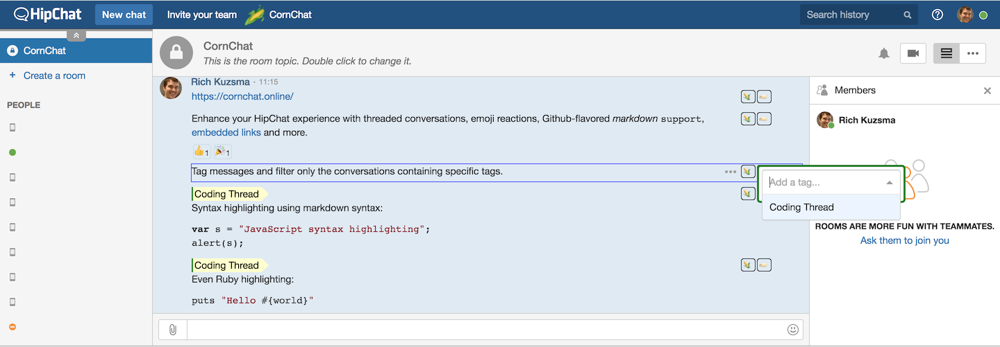
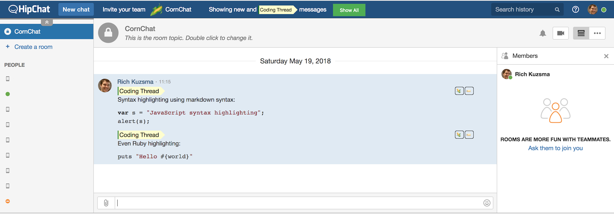
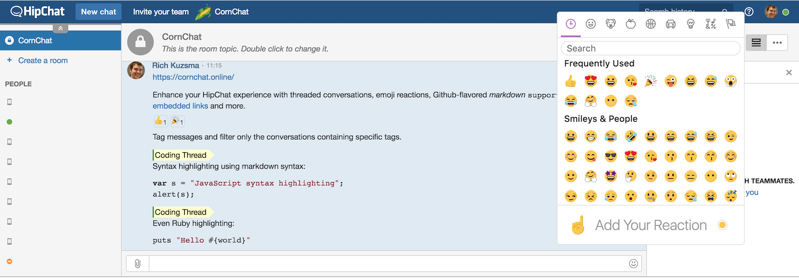

title: CornChat - HipChat's Missing Features
---

# CornChat

_Enhance HipChat with the features you've always wanted._

Tag individual messages, and use Github-Flavored Markdown:




Filter message threads by tag:




React to individual messages with emoji:




## Getting Started

The Beta version of CornChat is now available.

### HipChat for Mac Installation

```bash
$ (todo: some cmd to inject the bundle)
```
> Restart your HipChat client and you should see it running.

### HipChat Browser Installation

Login to your HipChat app and run this command to inject CornChat onto the page:

```javascript
var cornchat = document.createElement('script');
cornchat.setAttribute('src','https://TODO_PROVIDE_FULL_PATH_TO_THE_BUNDLE/bundle.js');
document.head.appendChild(cornchat);
```

### HipChat for Windows

_Coming soon!_


## How it Works

TODO: Teaser about how it works, with link to deeper architecture.


## Licensing

CornChat is [free](https://github.com/rkuzsma/cornchat/) and [open source](https://github.com/rkuzsma/cornchat) forever.

Reactions and tags are stored on our AWS server. No guarantees for uptime or data loss. You can always (TODO: LINK!) host it yourself if the free, public, hosted version isn't sufficient.


## Cure Cancer

Like CornChat? Hate Cancer? Please help my daughter Quinn and [donate 5 bucks to Alex’s Lemonade Stand](https://www.alexslemonade.org/donate). Don’t think too hard about it, just do it. It takes 2 minutes and the payment form is beautifully designed. You'll feel great doing it.
